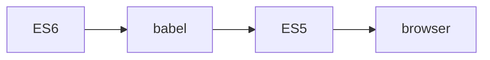
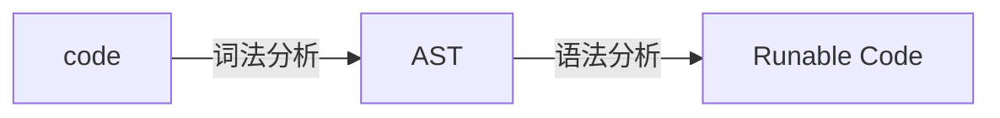
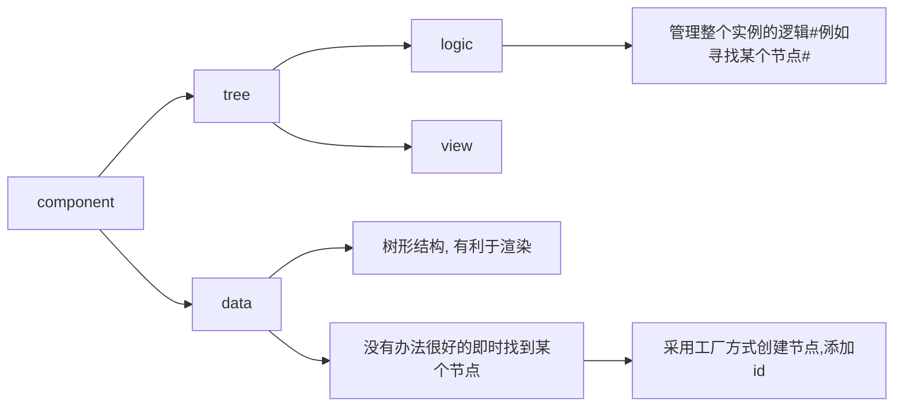

# ES6 项目实战

相关文章：[[ES6 规范详解]]

## 课程目标

### 框架搭建与业务实战

- Babel 简介
- ES6 语义转换以及原理
- ES6 实战

## 知识要点

Babel 用于将高版本的 JS 语法翻译成低版本的 JS 代码，以便在老版本的浏览器中运行



可以通过 babel 对一些新语法进行转义，查看转换后的代码可以很好的帮助我们理解新语法的用法和实现。

### Babel 转义

```sh
babel source.js -o dist.js
```

将 source.js 转义成低版本并作为 dist.js 进行输出

### AST 抽象语法树生成



词法分析就是将书写的代码转成语法树，而语法分析是把语法树转译成真正可以运行的代码

> Unexpected Token '..'
> Token 为 AST 概念里的令牌流，报此错误是因为没有能识别到一个有效的关键字

### 如何编写一个 Babel 的插件

本质上就是一个函数，具体形式为

```js
// plugin.js
module.export = () => {
  return {
    visitor: {
      Identifier(path) {
        const _nodeName = path.node.name;
        const _nodeType = path.node.type;
      }
    }
  };
};

// main.js
const { transfromSync } = require('@babel/core');
const plugin = require('./plugin.js');

const code = `function a () {};`;

const options = {
  plugin: ['./index.js']
};

const output = transfromSync(code, options);
```

### 利用 ES6 的知识实现简单的 Tree 组件

实现之前针对要实现的功能进行具体分析，接下来的代码以 Tree 组件为例进行分析。

- Tree 主体文件，外层逻辑，接收传参，统一事件管理
- Node 节点部分。具体显示，考虑 level 缩进, expand 展开逻辑, check 逻辑

实现时注意可采用面向对象的实现思想以及视图和逻辑的分离。



> 可利用 webAssemble 进行纯逻辑运算来进行优化。

## 补充知识点

### 如果给你一段代码，例如 count = 3, 怎么解析为语法树?

先找到关键字或者运算符的位置，根据其具体类型找到其左值和右值。依据查找到的关键值的类型进行特定类型树的构建。

### 微内核和微前端

微内核指的是一种架构模式，例如 Babel core。内核只实现了基座以及一些最基本的功能，别的功能以插件的方式进行封装，这样可以保证内核代码的简洁和纯净，同时使插件相对独立。

微前端则主要解决的是跨端，跨技术栈的问题。每个部分都是独立的服务，组件即服务，可以采用完全不同的技术方案。最终组合起来的结果相对完整统一即可。
