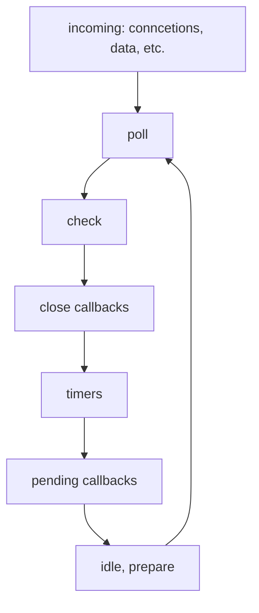

# Node.js 介绍

相关文章: [[Node.js 介绍]] [[网络]]

## 课程目标

- Buffer
- Stream
- Events
- 全局对象解析
- NodeJS 事件循环模型

## 知识要点

### Buffer

#### ArrayBuffer

ArrayBuffer 可以理解为一段内存，它是一段通用的，固定长度的原始二进制数据缓冲区。具体的存储内容需要其他的声明

ArrayBuffer 可以直接操作吗？

不能。通过类型数组对象来操作。（TypedArray）它会将缓冲区的数据表示为特定的格式。

```js
const buffer = new ArrayBuffer(8);
const int16Buffer = new Int16Array(buffer);
```

#### Unit8Array

Unit8Array 表示为一个 8 位的无符号数组，创建的时候内容会被初始化为 0.
具体操作可以类比于数组，相对于数组多了一些关于内存的东西。比如 BYTES_PER_ELEMENT --> 每个元素占用的字节数

1 Byte = 8 Bit
js Number 是用 64 位浮点数，换算成字节为 8Byte

ArrayBuffer 与 TypedArray 的关系是什么？

TypedArray: Uint8Array, Int32Array 统称为 TypedArray, 前面的单词代表了 Array 的类型

ArrayBuffer: 本身是一个 0 和 1 存放在一行里的一个集合

1. 可以使用一个 Int8 的确定类型数组来分离存放 8 位的二进制字节
2. 使用一个无符号的 Int16 来存放 16 位的二进制字节

#### 总结

ArrayBuffer 扮演了原生内存的角色。

### NodeJs Buffer

Buffer 类依照一种更适应于 NodeJs 的方式实现了 Uint8Array 相关的 API

Buffer 的实例是整形数组

而 Buffer 的大小在创建的时候就已经确定了，无法进行调整。

#### 常见 API

1. alloc 创建一个长度为 n，填充为 i 的 Buffer

```js
const buf1 = Buffer.alloc(n, i);
```

### Stream

NodeJs 主要提供了几种流, 它的输入输出默认是 Buffer 或者 String

Stream.Readable, Stream.Writable, Stream.Duplex, Stream.Transfrom

#### Readable

创建可读流

```js
const Readable = require('stream').Readable;

class ToReadable extends Readable {
  constructor(iterator) {
    super();
    this.iterator = iterator;
  }

  _read() {
    const res = this.iterator.next();
    if (res.done) {
      return this.push(null);
    }
    setTimeout(() => {
      this.push(res.value + '\n');
    }, 0);
  }
}

const iterator = (function (limit) {
  return {
    next: function () {
      if (limit--) {
        return { done: false, value: limit + Math.random() };
      }
      return { done: true, value: null };
    }
  };
})(10000);

const readable = new ToReadable(iterator);

readable.on('data', (data) => {
  process.stdout.write(data);
});

readable.on('end', () => {
  process.stdout.write('DONE');
});
```

创建可读流的时候需要继承 Readable, 并且实现\_read 方法

- \_read 是生产数据的逻辑
- 在\_read 方法中，通过调用 push(data)这种方式，将数据放入可读流中供下游消耗
- 当所有数据生产完成后，push(null)来通知可读流已经消耗完成
- 当可读流结束之后，不能再调用 push(data)

可以通过监听 data 事件来消耗可读流的数据

- 在首次监听 data 事件后，readable 实例会不断调用\_read 方法生产数据
- 当所有的数据生产完毕后，会触发 end 事件

#### Writable

创建可写流

可以直接通过函数调用的方式进行创建

```js
const Writable = require('stream').Writable;

const writable = Writable();

writable._write = function (data, enc, next) {
  process.stdout.write(data.toString().toUpperCase());
  process.nextTick(next); // 异步
  // next(); // 同步
};

writable.on('finish', () => process.stdout.write('DONE'));

writable.write('line1' + '\n');
writable.write('line2' + '\n');
writable.write('line3' + '\n');

writable.end();
```

1. 上游通过调用 write 方法将数据写入到可写流中。
2. 在\_write 中，当数据成功写入后，需要调用 next 方法告诉流开始处理下一个数据
3. 上游必须调用 end 方法来结束可写流
4. 当调用 end 方法后，会触发 finish 事件

#### Duplex

创建可读可写流, 需要类似与可读流和可写流，实现\_read, \_write 方法
可读流与可写流的数据相对而言是隔离的。

```js
const Duplex = require('stream').Duplex;

const duplex = Duplex();

duplex._read = function () {
  this._readCount = this._readCount || 0;
  if (this._readCount > 1) {
    this.push(null);
  } else {
    this.push(`${this._readCount++}`);
  }
};

duplex._write = function (buf, enc, next) {
  process.stdout.write(`_write ${buf.toString()}\n`);
  process.nextTick(next);
};

duplex.on('data', (data) => console.log(`onData = ${data.toString()}`));

duplex.on('finish', () => console.log('DONE'));

duplex.write('a');
duplex.write('b');
duplex.write('c');

duplex.end();
```

#### Transform

创建可读可写流，是一种管道的形式。实现\_transform 方法
在 Transfrom 中可写流端写入的数据，经过自动变化后可以自动添加到可读流中进行使用。

### Events

### 全局对象

在 Node 中，其实全局对象指的就是 global 对象，对标与浏览器中的 window
但 global 对象之下还有众多的全局对象

```js
global = {
  Buffer,
  console,
  setTimeout,
  clearTimeout,
  setInterval,
  clearInterval,
  process
};
```

常见的全局事件:

1. exit
   当进程被退出时触发, 会添加一个退出码作为参数。0 为正常退出，其他为错误码
2. UncaughtException
   当抛出的错误一直未捕获时触发

### NodeJs 的事件循环模型



1. timers: setTimeout 和 setInterval 的回调执行阶段
2. pending callbacks: 上一阶段推迟到当前循环迭代的 I/O 回调
3. idle, prepare: 系统内部使用的阶段，可以不用特别关注
4. poll: 执行与 I/O 相关的回调，除了 timers, close callback, setImmediate, 其他的回调函数都在此阶段执行
5. check: 执行 setImmediate 回调
6. close callback: 执行一些关闭的回调。例如套接字关闭

#### process.nextTick()

会在每一轮中的每个循环步骤之后进行检查并执行。

#### Microtasks 微任务

在 NodeJs 中来说，微任务只可能来自于 process.nextTick()或者 Promise.then()

输出顺序一定是 process.nextTick 先执行

## 补充知识点

### allocUnsafe

当调用 Buffer.allocUnsafe()时，被分配的内存段时为初始化的。
内存的分配非常快，但是分配的内存段可能包含潜在的旧数据。
具有明显的性能优势，但是如果使用不当，会给程序引入安全漏洞。

### Buffer 与字符编码

Buffer 的实例一般用于表示编码字符的序列。
NodeJs 中目前支持的字符编码

1. ASCII - 仅支持 7 位的 ASCII 数据
2. UTF-8 - 多字节编码的 Unicode 字符。HTML 较为常用。
3. Base64 - 按照特定映射进行编码

```js
const buf = Buffer.from('sfilata', 'ascii');
```

### 为什么流操作一定要进行 toString 处理

因为流操作可能会出现 Buffer 或者 String，统一使用 toString 方法操作可以便于查看与操作
shell 中通过管道连接上下游，其输入输出都是标准文本流
在 NodeJs 中, Stream 中的数据都是 Buffer

- 可读流是 push(data) data: String | Buffer，消耗 data 的时候，data 的事件输出的数据都是 Buffer
- 可写流是 write(data) data: String | Buffer, \_write 传入的数据类型都是 Buffer 类型

但可以通过 objectMode: true 的设置来生产任意类型的数据

```js
const Readable = require('stream').Readable;

const readable = Readable({ objectMode: true });
readable.push('a');
readable.push({});
readable.push(null);

readable.on('data', function (data) {
  console.log(data);
});
```

### 手写实现一个 EventBus

```js
class EventEmitter {
  constructor() {
    this.events = {};
  }

  emit(event, ...args) {
    const callbacks = this.events[event];

    if (!callbacks) {
      console.log('With no listeners');
      return this;
    }

    callbacks.forEach((cb) => cb.apply(this.args));
    return this;
  }

  on(event, callback) {
    if (!this.events[event]) {
      this.events[event] = [];
    }

    this.events[event].push(callback);
    return this;
  }

  once(event, callback) {
    const func = (...args) => {
      this.off(event, func);
      callback.apply(this, args);
    };
    this.on(event, func);
    return this;
  }

  off(event, callback) {
    this.events[event] = null;
    return this;
  }
}
```

此 EventEmmiter 只是一个简单的同步调用，所以事件触发是同步的

### 在 Nodejs 中，直接打印 this 会输出什么?

```js
console.log(this); // {}
module.exports = { hello: '123' };
console.log(this); // { hello: '123' }
```

在当前模块打印 this 并不会输出 global, 而是会输出 module.exports

### setTimeout 和 setImmediate 的区别

两者在概念和表现形式上极其相似，但是根据调用时间的不同，他们的行为也不同。

- setImmediate 设计为在当前轮训 poll 阶段后执行脚本。
- setTimeout 设计为在以毫秒为单位的最小阈值过去之后运行脚本。

可能会遇到的情况:

1. 在主模块中执行
   由于在执行中无法确定 timer 阶段是否存有回调，所以两者之间的执行结果不确定。
   如果有会回调就先执行 timer 中的回调，再执行 check 阶段，执行 setImmediate
   如果没有回调就先执行 check 阶段，然后在下一轮循环 timer 阶段的时候再执行 setTimeout 回调
2. 在同一个 I/O 回调中执行（读取文件, setTimeout）
   在这种情况中总有 setImmediate 先执行

### 写出下面代码的输出顺序

```js
async function async1() {
  console.log('async1 start');
  await async2();
  console.log('async1 stop');
}
async function async2() {
  console.log('async2');
}
console.log('script start');
setTimeout(() => {
  console.log('setTimeout0');
  setTimeout(() => {
    console.log('setTimeout1');
  }, 0);
  setImmediate(() => console.log('setImmediate'));
}, 0);

process.nextTick(() => console.log('nexttick'));
async1();
new Promise(function (resolve) {
  console.log('promise1');
  resolve();
  console.log('promise2');
}).then(function () {
  console.log('promise3');
});
console.log('script end');

// script start
// async1 start
// async2
// promise1
// promise2
// script end
// nexttick
// async1 stop
// promise3
// setTimeout0
// setImmediate
// setTimeout1
```
