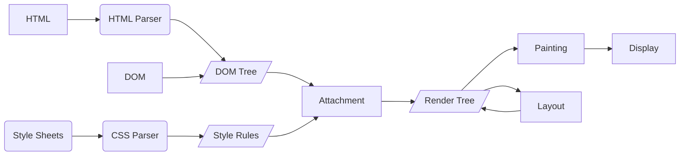

# React 基本概念以及工作原理

## 课程目标

- 了解 React 相关的各种概念
- 分析 React 的源码
- 自己动手实现一个简单版的 React

## 知识要点

### 虚拟 Dom

虚拟 Dom 其实就是一个用来表示 Dom 信息和结构的 JS 对象，当状态变更的时候，会重新渲染这个 JS 对象结构

传统 DOM 渲染流程

DOM 操作开销是非常大的，里面包含的属性特别庞大，而且直接操作 DOM 会导致页面重新排版。 所以我们需要使用一种尽可能低成本，无影响的方法去操作 DOM 来更新视图

React 中使用 JSX 语法来描述视图。状态发生变化之后，使用 diff 算法来对比新老视图，依据结果来进行最终的 DOM 操作。

> JSX 是一种语法糖，使用其来替代常规的 Javascript，看起来很像 HTML 节点。
> 使用 JSX 以后，可以免除繁琐的 React.createElement 调用，使编写代码更加容易。
> 同时针对 JSX, Ract 会对其进行优化和检查，使其运行更快，而且语法错误在编译阶段时就可以暴露出来。

### 核心 API

#### ReactDOM.render

首次调用，没有旧的节点，所以容器节点里的 DOM 元素全部会被替换，在接下来的更新调用时，则会使用 React Diffing alogorithm 算法进行高效更新。

> 提供一个可选的回调函数，回调函数将会在渲染或者更新之后被执行

## 补充知识点

#### JSX React17 与 React18 使用方式的区别

React 17 之前使用 JSX 写代码，是通过 babel-loader 进行转义。在 17 之后，会自动从 React 的 package 中引入新的入口函数并调用。

#### 组件的节点类型
