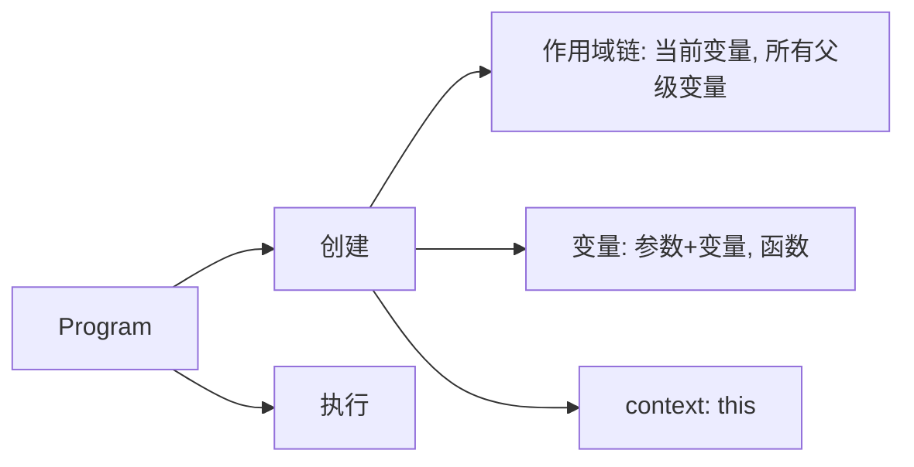

# this 指针/闭包/作用域

## 课程目标

## 知识要点

### 上下文 + 作用域

#### 作用域链

```js
let a = 'global';
console.log(a);

function course() {
  let b = 'sfilata';
  console.log(b);

  session();
  function session() {
    let c = 'this';
    console.log(c);

    teacher();

    function teacher() {
      let d = 'hello';
      console.log(d);

      // 查找b的过程就属于作用域链查找
      console.log(b);
    }
  }
}
course();
```

### this 上下文 Context

this 在不同的场景下有不同的指向, 每次具体 this 的值需要在代码执行的时候才能获取到准确的值

1. 函数直接调用
   这时的 this 指向的是 window

```js
function fun() {
  console.log(this);
}

fun(); // window
```

2. 隐式绑定
   this 指向调用它的对象，指向调用堆栈的上一级

```js
let a = 1;
let obj = {
  a: 2,
  indistinctFun() {
    console.log(this.a);
  }
};
obj.indistinctFun(); // 2

const foo = {
  bar: 10,
  fn: function () {
    console.log(this.bar);
    console.log(this);
  }
};
let fn1 = foo.fn;
fn1(); // window, 因为是直接执行的
// 如何去改变this指向

const foo2 = {
  text: 'foo2',
  fn: function () {
    return this.text;
  }
};
const foo3 = {
  text: 'foo3',
  fn: function () {
    return foo2.fn();
  }
};
const foo4 = {
  text: 'foo4',
  fn: function () {
    let fn = foo2.fn;
    return fn();
  }
};
console.log(foo2.fn()); // foo2
console.log(foo3.fn()); // foo2
console.log(foo4.fn()); // undefined
```

- 在执行函数时，如果函数被上一级所调用，那么它的上下文指向调用它的上一级
- 函数直接执行时，上下文指向 window
- 箭头函数有单独的上下文, 使用上一级作用域的 this

3. 显式绑定(bind | apply | call)

```js
function foo() {
  console.log(this.text);
  return this.text;
}
let a = { text: 'success' };
foo.call(a);
foo.apply(a);
foo.bind(a)();
```

4. new 调用

```js
class User {
  constructor(name) {
    this.name = name;
  }
  getName() {
    return this.name;
  }
}
const user = new User('sfilata');
console.log(user.getName()); // 'sfilata'
```

> this 指向的优先级问题
> new -> 显式绑定 -> 隐式绑定 -> 直接调用

### 闭包(突破作用域的束缚)

函数与它周围状态的捆绑组合

#### 常见场景

1. 函数作为返回值
   在函数外部获取到了函数作用域内的变量值

```js
function foo() {
  let str = 'sfilata';
  return function () {
    console.log(str);
  };
}

foo()();
```

2. 函数作为参数

```js
function foo(fn) {
  let str = 'sfilata';
  fn();
}
function param() {
  console.log(str);
}
foo(param);
```

3. 函数嵌套
4. 事件处理，异步执行的闭包

```js
for (var i = 0; i < 5; i++) {
  (function (i) {
    setTimeout(function () {
      console.log(i);
    }, 0);
  })(i);
}
```

利用闭包来实现私有变量

```js
const createItems = function () {
  const items = [];
  const str = items.join(',');
  return {
    push: function (item) {
      items.push(item);
    },
    getItems: function () {
      return items;
    },
    getStr: function () {
      return items.join(',');
    }
  };
};

const { push, getItems, getStr } = createItems();
push(1);
push(2);
console.log(getItems()); // [1, 2]
console.log(getStr()); // 1,2
```

### 知识图谱



## 补充知识点

#### 手写一个 bind 函数

手写功能之前，首先分析 bind 函数应该挂载在哪里(Function.prototype)

```js
Function.prototype.newBind = function (context, ...rest) {
  const _this = this;
  return function () {
    return _this.apply(newThis, rest);
  };
};
```

#### apply 的应用 - 多传参数组化

```js
Math.max.apply(this, [2, 3, 4, 5]); // 5
```
