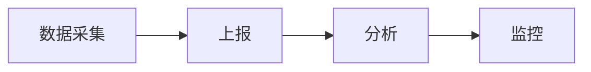

# 课程目标

- 数据埋点方案以及监控方案
- 列表无限滚动方案

# 知识要点

## 数据埋点方案



按钮点击形式数据采集

埋点常见内容

- 是否登陆
- 数据角色

一般内容是由产品和运营而定，定义埋点的具体内容，前端确定是否可行，是否可写

上报的内容

1. 埋点的标识信息 eventId, eventType: click
   > pv: page view, A 用户访问页面 2 次，2pv
   > uv: user page view, A 用户访问页面 2 次，1uv
2. 业务自定义的信息，比如电商网站 sku (特征的排列组合)
3. 通用的设备信息/用户信息，比如 userId, deviceId, User Agent(用户的设备类型以及设备操作系统版本...), timeStamp, location

上报的类型

- 实时上报, 调用 report 之后立即发送请求
- 延时上报, 为解决埋点过多(请求并发过多，过于频繁), 在 sdk 内统一收集业务方要上报的信息，在时间段内持续采集，到时间以后将采集到的信息一起上报(依托于防抖或者别的功能，或者在闲置的时候统一上报，上报失败以后做补偿措施)

### 上报方式

- 代码埋点 直接在代码层面进行埋点，修改比较繁琐
- 无埋点 根据层级信息唯一标识点击元素
  > 可能会出现性能问题，比如频繁点击空白区域，会发送很多不必要的请求
  > 无法太过于个性化，如果埋点与业务过于紧密的话，则无法处理
- 可视化埋点
  > 后台 iframe 嵌入线上的业务页面

附带防抖功能的上报类

```ts
import { debounce } from 'lodash';
// async-tasks-queue
interface RequiredData {
  timeStamp: number;
  id: string;
}

class TaskQueueStorableHelper<T extends RequiredData> {
  protected store: any = null;
  private STORAGE_KEY = 'private_store';

  // The single instance structure
  private static instance: TaskQueueStorableHelper | null = null;
  public static getInstance<T extends RequiredData = any>() {
    if (!this.instance) {
      this.instance = new TaskQueueStorableHelper<T>();
    }
    return this.instance;
  }

  constructor() {
    const localStorageValue = localStorage.getItem(this.STORAGE_KEY);
    if (localStorageValue) {
      this.store = JSON.parse(localStorageValue);
    }
  }

  get QueueData() {
    return this.store?.queueData || [];
  }

  set QueueData(queueData: T[]) {
    this.store = {
      ...this.store,
      queueData: queueData.sort((a, b) => Number(a.timeStamp) - Number(b.timeStamp))
    };
    localStorage.setItem(this.STORAGE_KEY, JSON.stringify(this.store));
  }
}

// AsyncTaskQueue
export abstract class AsyncTaskQueue<T extends RequiredData = any> {
  private get storableService() {
    return TaskQueueStorableHelper.getInstance<T>();
  }

  private get queueData() {
    return this.storableService.queueData;
  }

  private set queueData(value: T[]) {
    this.storableService.queueData = value;
    if (value.length) {
      this.debounceRun();
    }
  }

  protected debounceRun = debounce(this.run.bin(this), 1000);
  protected abstract consumeTaskQueue(data: T[]): Promise<any>;

  protected addTask(data: T | T[]) {
    this.queueData = this.queueData.concat(data);
  }

  private run() {
    // can reset the queueData according to the id
    const currentDataList = this.queueData;
    if (currentDataList.length) {
      this.queueData = [];
      this.consumeTaskQueue(currentDataList).catch((_) => {
        // TODOs: report error, try again
      });
    }
  }
}

// track.ts
import { AsyncTaskQueue } from './async-task-queue';
import axios from 'axios';

interface TrackData {
  seqId: number;
  id: string;
  timeStamp: number;
}

interface UserTrackData {
  msg?: string;
}

export class BaseTrack extends AsyncTaskQueue<TrackData> {
  private seq: number = 0; // confirm the data if whole task
  public consumeTaskQueue(data: any) {
    return new Promise((resolve) => {
      const image = new Image();
      image.onload = () => {
        resolve(true);
      };
    });
    return axios.post(`http://example.com`, { data });
  }

  public track(data: userTrackData) {
    this.addTask({
      seqId: this.seq++,
      id: uuid(),
      timeStamp: Date.now(),
      ...data
    });
  }
}
```

### 无埋点

监听所有事件，上报所有点击事件以及对应的事件所在的元素，最后通过后台去分析数据

GrowingIO, 神策，诸葛 IO，Heap

#### 实现

1. 监听 window 元素

```ts
window.addEventListener(
  'click',
  (event) => {
    const target = event.srcElement || event.target;
    const xPath = getXpath(target);

    // report the xPath element
    report({ xPath });
  },
  true
);
```

2. 获取元素的唯一标识 xPath

```js
function getXpath(element: HTMLElement) {
  if (element.id) {
    return `//*[@id=\"${element.id}\"]`;
  }

  if (element === document.body) {
    return '/html/' + element.tagName.toLowerCase();
  }

  let currentIndex = 1;
  let siblings = element.parentNode.childNodes;

  for (let sibling of siblings) {
    if (sibling === element) {
      return getXpath(element.parentNode) + '/' + element.tagName.toLowerCase() + `[${currentIndex}]`;
    } else if (sibling.nodeType === 1 && sibling.tagName === element.tagName) {
      currentIndex++;
    }
  }
}
```

## 数据监控系统

## 列表无限滚动方案

1. 下拉到底，会继续加载数据并且进行数据拼接
2. 数据太多，要做虚拟列表的展示

### 虚拟列表

虚拟列表的实现，就是在首屏加载的时候只加载可视区域内需要的列表项，当滚动发生的时候，通过动态计算，获得可视区域内的列表项，并且将非可视区域内存在的列表项删除

1. 计算出可视区域起始数据的索引, startIndex
2. 计算出可视区域结束数据的索引, endIndex
3. 计算当前可视区域内的数据，并且渲染到页面中
4. 计算 startIndex 对应的数据，在整个列表中的偏移位置 startOffset, 并且设置到列表上

### 滚动

由于知识对可视区域内的列表进行渲染，为了保持列表容器的高度并可正常的触发滚动

需要一个元素展示真正渲染的数据
需要一个元素来撑开高度保证滚动

### 容器

1. infinite-list-container
2. infinite-list-phantom 占位元素，撑开高度
3. infinite-list 列表项的渲染区域

### 监听滚动

监听 infinite-list-container 的滚动事件，获取 scrollTop

可视区域的高度: screenHeight
列表项的高度: itemSize
列表数据: listData
当前的滚动位置: scrollTop

### 计算出最终想要的数据

列表总高度: listHeight = listData.length \* itemSize
可显示的列表项: visibleCount = Math.ceil(screenHeight / itemSize)
计算数据的起始索引: startIndex = Math.floor(scrollTop / itemSize)
计算数据的结束索引: endIndex = startIndex + visibleCount
列表真正显示数据: visibleData = listData.slice(startIndex, endIndex)

startOffset, 通过 css 来控制
startOffset = scrollTop - (scrollTop % itemSize)

# 补充知识点

## 错误信息常见类别

1. js error window.addEventListener('error')
2. resource error window.addEventListener('eror')
3. unhandlePromise
4. 业务相关自定义错误消息

## 垂直公司

声网 音频相关
