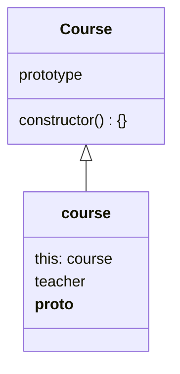

# 面向对象编程/原型及原型链

## 课程目标

- 对象是什么
- 构造函数
- 原型对象
- 实现继承以及多种继承方式

## 知识要点

### 对象是什么？为什么要面向对象

#### 概念

对象是对于单个物体的简单抽象
是一个封装了方法和属性的容器

> 属性： 对象的状态。方法：对象的行为。

```js
const user = {
  name: 'sfilata',
  getName() {
    return 'Getting the name' + this.name;
  }
};
```

#### 特点

逻辑迁移灵活，代码可复用性高，高度模块化

### 构造函数

用来生成函数的对象。-- 生成对象的时候需要做一些初始化的操作，而这些操作在构造函数里面完成。
类为生成对象的模版，对象是类的实例化。
**JavaScript** 本质上不是基于类的语言，而是基于对象的语言。

```js
function User(name, age) {
  this.name = name;
  this.age = age;
  this.sayHello = () => {
    console.log(`I'm ${this.name}, I'm ${this.age} years old`);
  };
}

const student = new User('sfilata', 18); // constructor
```

- 一般构造函数第一个字母大写
- 调用的时候一般使用**new**关键字进行调用
- 函数体里面用**this**指代需要实例化的对象

// TODOs: Search the \_\_proto\_\_ and prototype
构造函数生成的对象，其 constructor 指向构造函数, 其原型指向构造函数的 prototype

### 继承

在原型对象的所有属性和方法，都能被实例所共享

#### 原型链继承

```js
function Vehicle() {
  this.name = 'car';
}
Vehicle.prototype.getName = function () {
  return this.name;
};

function Car() {}
Car.prototype = new Vehicle();
Car.prototype.constructor = Vehicle;
const car = new Car();
```

原型链继承有什么缺点

- 父类属性一旦赋值给子类的原型属性，此时属性属于子类的共享属性
- 实例化子类时，没有办法给父类传参

解决方案：使用构造函数继承 -> 在子类构造函数内部调用父类构造函数

#### 构造函数继承

```js
function Vehicle() {
  this.name = 'car';
}
Vehicle.prototype.getName = function () {
  return this.name;
};

function Car() {
  Vehicle.call(this);
}

const car = new Car();
```

解决了共享属性问题和父类传参问题

#### 组合继承(结合构造函数继承和原型链继承的解决方案)

```js
function Vehicle() {
  this.name = 'car';
}
Vehicle.prototype.getName = function () {
  return this.name;
};

function Car(argu) {
  Vehicle.call(this, argu);
}
Car.prototype = new Vehicle();
Car.prototype.constructor = Vehicle;

const car = new Car();
```

存在问题：无论何种场景，都会调用两次父类构造函数。如果存在于计数相关的逻辑的话，可能会出现 Bug。

#### 寄生组合继承

```js
function Vehicle() {
  this.name = 'car';
}
Vehicle.prototype.getName = function () {
  return this.name;
};

function Car(argu) {
  Vehicle.call(this, argu);
}
Car.prototype = Object.create(Vehicle); // 使用Object.create创建对象来拿到相应的原型链上的共享函数
Car.prototype.constructor = Vehicle;

const car = new Car();
```

## 补充知识点

#### 构造函数不初始化的话可以使用吗？

不可以，因为没有返回值。

#### 如果需要使用的话，如何去做一个兼容？

```js
function User(name, age) {
  const _isClass = this instanceof User;
  if (!_isClass) {
    return new User();
  }
  this.name = name;
  this.age = age;
  this.sayHello = () => {
    console.log(`I'm ${this.name}, I'm ${this.age} years old`);
  };
}
```

#### 关于 new 关键字，它的概念和原理是什么？调用的时候具体做了什么？

1. 创建一个空对象，作为将要返回的对象实例
2. 将生成的对象的`__proto__`指向构造函数的`prototype`属性
3. 将当前实例对象赋给内部的 **this**
4. 执行构造函数初始化代码

#### 使用构造函数有什么缺陷/性能问题？

构造函数无法满足生成通用方法的要求。

解释：构造函数中指明的方法每个实例里面都是单独的方法。重复挂载会导致资源的浪费。

解决方法：把需要共用的函数挂载在构造函数的原型上(`User.prototype`)。通过原型链访问的这个实例方法只存在一个。



#### 看起来组合继承方式完美解决了继承问题，如何实现多重继承

```js
Child.prototype = Object.assign(Object.create(Parent1), Object.create(Parent2));
```
